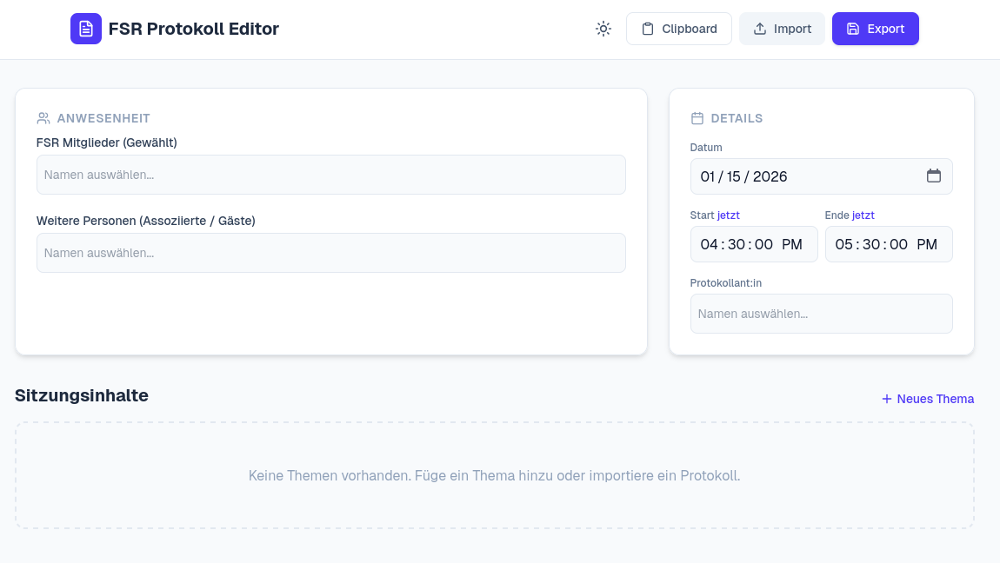
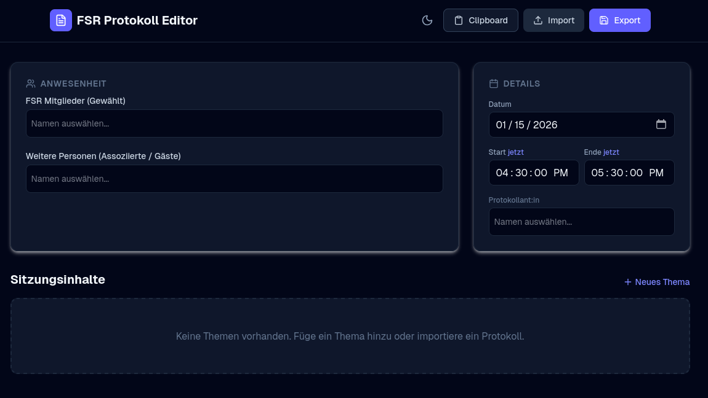
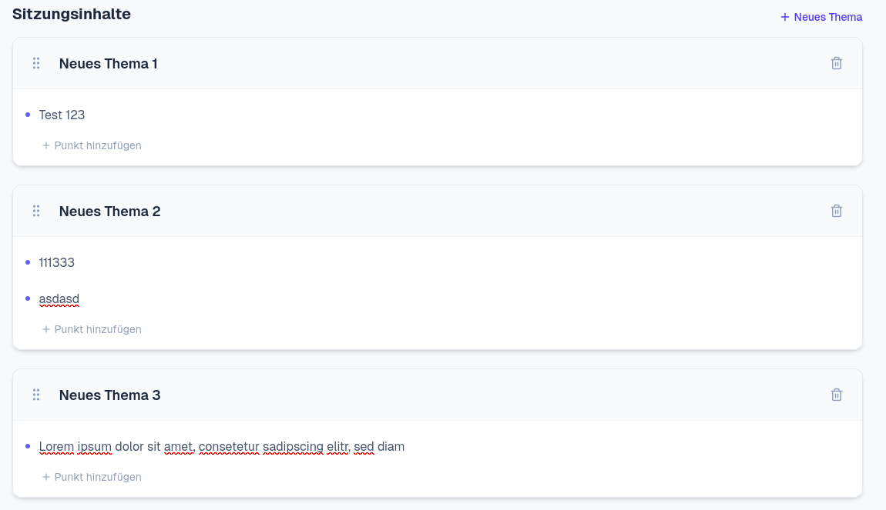
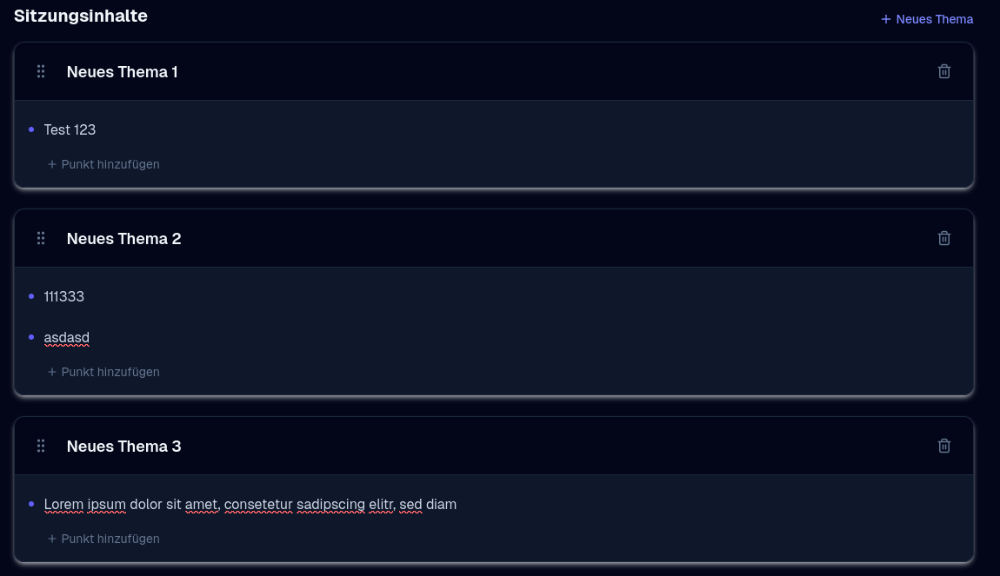

# FSR Protocol Editor

A web-based editor for managing and generating protocols for Student Council (FSR-Informatik) meetings. Built with Next.js and Tailwind CSS.

[](https://nextjs.org/)
[](https://react.dev/)
[](https://www.typescriptlang.org/)
[](https://tailwindcss.com/)
[](https://wakatime.com/badge/user/04b6ff37-1c8c-4a0c-bf7e-85a2901d61d1/project/d96edfb2-e2ca-4dd8-a18a-d19d5f419d85)

## Tech Stack

- **Framework**: [Next.js](https://nextjs.org/)
- **Styling**: [Tailwind CSS](https://tailwindcss.com/)
- **Icons**: [Lucide React](https://lucide.dev/)
- **Drag & Drop**: [@dnd-kit](https://dndkit.com/)
- **Data Handling**: [js-yaml](https://github.com/nodeca/js-yaml)


## Preview

### Full Interface

| Light Mode | Dark Mode |
| :---: | :---: |
|  |  |

### Member Selection

| Light Mode | Dark Mode |
| :---: | :---: |
|  |  |

### Session Management

| Light Mode | Dark Mode |
| :---: | :---: |
|  |  |

## Features

- **Session Management**: Easily organize meeting topics and points with Drag-and-Drop functionality.
- **Attendance Tracking**: Manage present FSR members, protocolant, and guests.
- **Protocol Metadata**: Set date, start time, and end time for the session.
- **Import/Export**:
  - Support for the YAML protocol data structure used by the current Discord Bot.
  - Clipboard integration for quick pasting the generated protocol Template.
- **Theming**: Dark and Light mode support.

## Getting Started

### Prerequisites

- Node.js (Latest LTS recommended)
- npm, yarn, or pnpm

### Installation

1.  Clone the repository:
    ```bash
    git clone https://github.com/Joshua154/fsr-protocol-editor.git
    cd fsr-protocol-editor
    ```

2.  Install dependencies:
    ```bash
    npm install
    ```

3.  Configure Environment Variables:

    Copy the example environment file:
    ```bash
    cp example.env.local .env.local
    ```

    Edit `.env.local` to set your default FSR members and associated members:
    ```env
    NEXT_PUBLIC_FSR_MEMBERS=Member1,Member2,Member3
    NEXT_PUBLIC_ASSOCIATED_MEMBERS=Guest1,Guest2
    ```

4.  Run the development server:
    ```bash
    npm run dev
    ```

5.  Open [http://localhost:3000](http://localhost:3000) with your browser to see the result.
