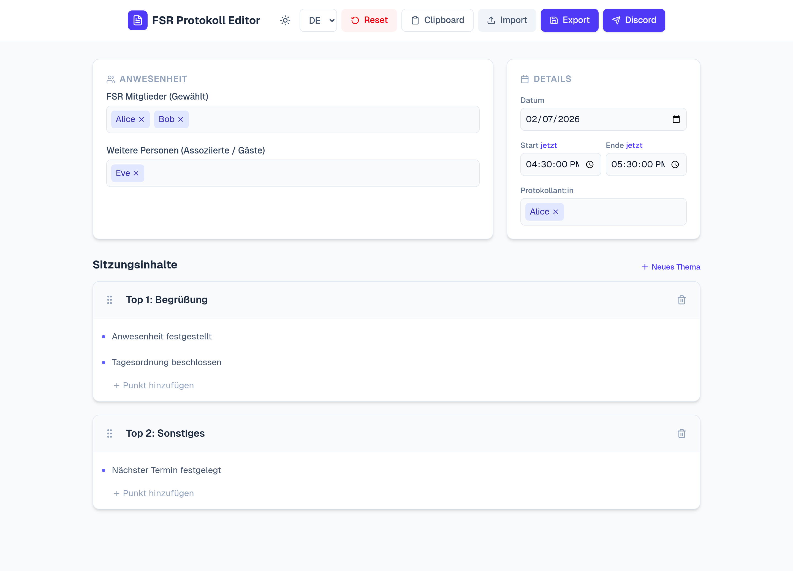
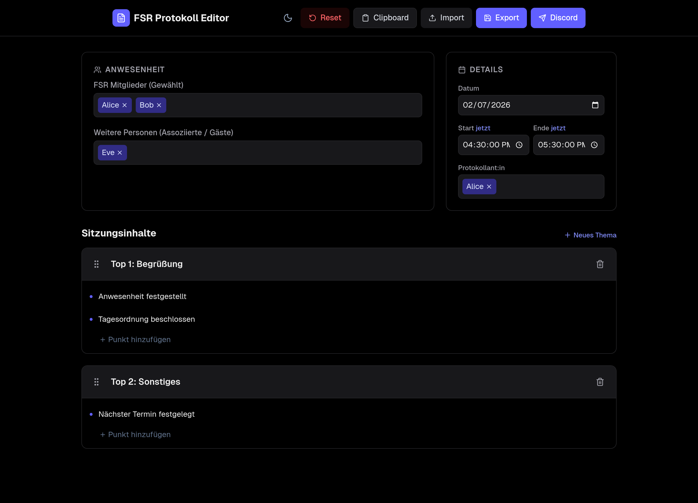
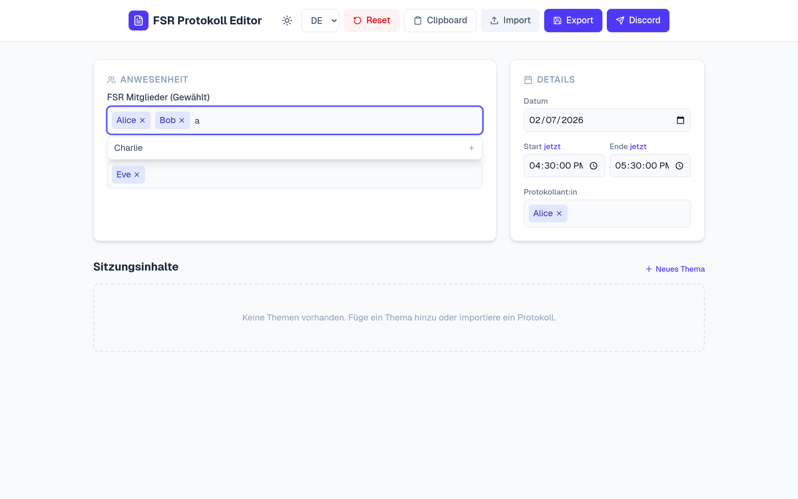
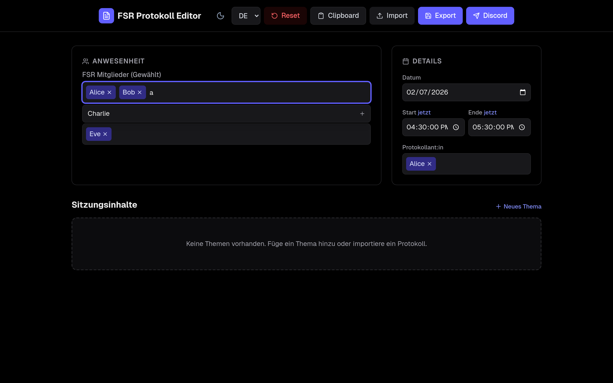
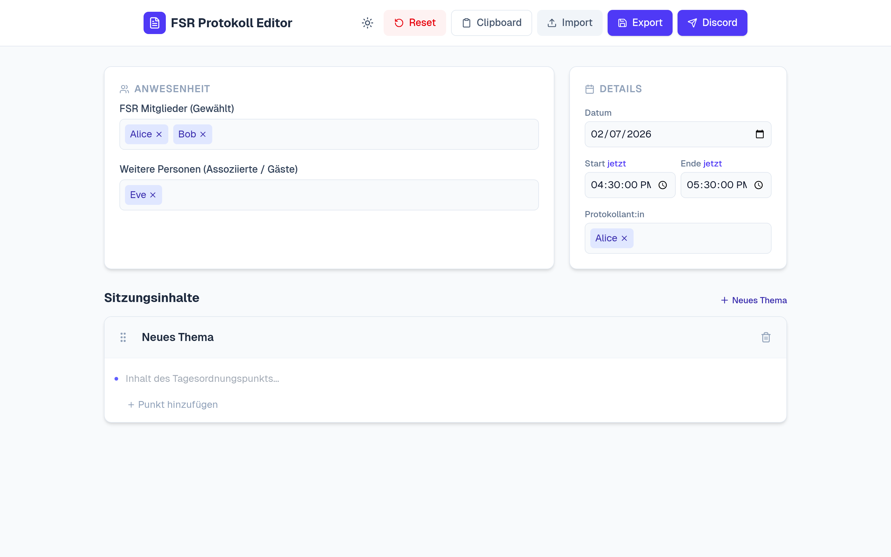
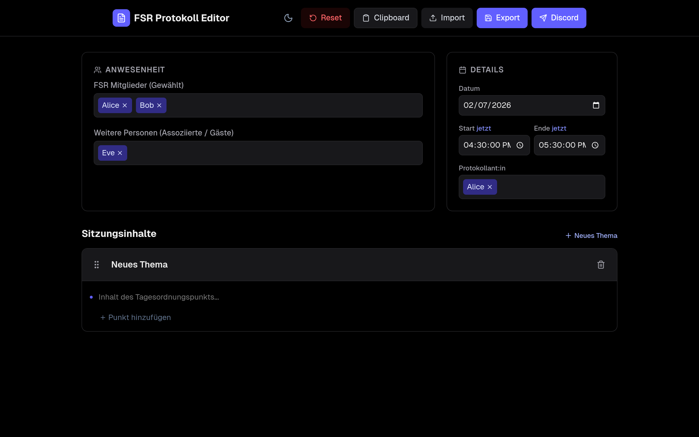

# FSR Protocol Editor

A web-based editor for managing and generating protocols for Student Council (FSR-Informatik) meetings. Built with Next.js and Tailwind CSS.

[](https://nextjs.org/)
[](https://react.dev/)
[](https://www.typescriptlang.org/)
[](https://tailwindcss.com/)
[](https://wakatime.com/badge/user/04b6ff37-1c8c-4a0c-bf7e-85a2901d61d1/project/d96edfb2-e2ca-4dd8-a18a-d19d5f419d85)

## Tech Stack

- **Framework**: [Next.js](https://nextjs.org/)
- **Styling**: [Tailwind CSS](https://tailwindcss.com/)
- **Icons**: [Lucide React](https://lucide.dev/)
- **Drag & Drop**: [@dnd-kit](https://dndkit.com/)
- **Data Handling**: [js-yaml](https://github.com/nodeca/js-yaml)


## Preview

The screenshots below are auto-generated. Re-generate them anytime with:

```bash
npm run previews:install
npm run previews
```

On **NixOS**, Playwright's downloaded browsers may not run (stub-ld). Use dev shell bundled Chromium instead:

```bash
nix develop
npm run previews
```

### Full Interface

| Light Mode | Dark Mode |
| :---: | :---: |
|  |  |

### Member Selection

| Light Mode | Dark Mode |
| :---: | :---: |
|  |  |

### Session Management

| Light Mode | Dark Mode |
| :---: | :---: |
|  |  |

<!-- ### Dialogs

| Feature | Light Mode | Dark Mode |
| :--- | :---: | :---: |
| Reset confirm |  |  |
| Import confirm |  |  |
| Clipboard confirm |  |  |
| Discord confirm |  |  |
| Discord password |  |  |
| Discord error |  |  | -->

## Features

- **Session Management**: Easily organize meeting topics and points with Drag-and-Drop functionality.
- **Attendance Tracking**: Manage present FSR members, protocolant, and guests.
- **Protocol Metadata**: Set date, start time, and end time for the session.
- **Import/Export**:
  - Support for the YAML protocol data structure used by the current Discord Bot.
  - Clipboard integration for quick pasting the generated protocol Template.
- **Theming**: Dark and Light mode support.

## Getting Started

### Prerequisites

- Node.js (Latest LTS recommended)
- npm, yarn, or pnpm

### Installation

1.  Clone the repository:
    ```bash
    git clone https://github.com/Joshua154/fsr-protocol-editor.git
    cd fsr-protocol-editor
    ```

2.  Install dependencies:
    ```bash
    npm install
    ```

3.  Configure Environment Variables:

    Copy the example environment file:
    ```bash
    cp example.env.local .env.local
    ```

    Edit `.env.local` to set your default FSR members and associated members:
    ```env
    FSR_MEMBERS=Member1,Member2,Member3
    ASSOCIATED_MEMBERS=Guest1,Guest2
    ```

4.  Run the development server:
    ```bash
    npm run dev
    ```

5.  Open [http://localhost:3000](http://localhost:3000) with your browser to see the result.

### Running with Docker

You can also run the application using Docker. This is useful for deployment or testing in a clean environment.

1.  **Configure Environment Variables**:
    You can set environment variables in `docker-compose.yml` or use an `.env.local` file.
    
    ```env
    FSR_MEMBERS="Alice [Ali, A], Bob, Charlie"
    ASSOCIATED_MEMBERS="Dave [David], Eve"
    ```
    You can define aliases for members using brackets `[]`. Searching for "Ali" will suggest "Alice".

2.  **Start the Container**:
    ```bash
    docker compose up -d --build
    ```
    or use this example
    ```yaml
    services:
        editor:
            image: ghcr.io/joshua154/fsr-protocol-editor:main
            container_name: fsr-protocol-editor
            ports:
            - "3000:3000"
            env_file:
            - .env.local
    ```

    ```bash
    docker compose up -d
    ```
